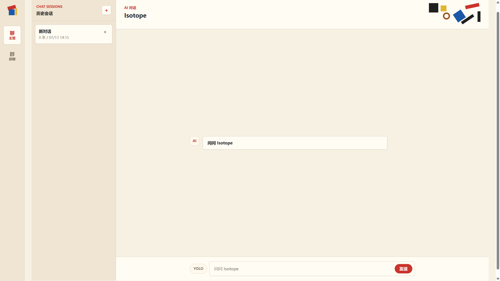

# Isotope

Isotope 是一个 local-first 的 AI 工程工作台，也是一个 Application-first 的个人 AI 助手。

它不只是一个 Supervisor——Isotope 将 LLM 驱动的会话管理、桌面交互、RAG 记忆检索、
屏幕控制、社交桥接和可审查的 agent 工作流整合为统一的本地工作台。



## 核心能力

### Agent Supervisor

- **会话扫描**：读取本机 Codex session 记录，识别工作目录、分支、最近消息和状态证据。
- **状态判断**：区分 `working`、`needs_user`、`stale`、`done` 等状态，输出中文摘要。
- **LLM-driven supervision**：让模型在受控动作集合中选择 `monitor`、`request_context`、`launch_session`、`ask_user` 等下一步动作。
- **多 worker 托管**：启动后台 worker 或接管 tmux 会话，跟踪状态协议和日志输出。
- **目标队列**：长期目标写入队列，由后台 daemon 动态消费、推进、归档或等待用户拍板。
- **集成审查**：查看已完成 worker 的分支、提交、diff、合并风险和后续验证建议。

### 桌面应用

基于 Tauri + Svelte 的 Windows-first 桌面客户端：

- **Chat 界面**：与 Supervisor 对话，支持会话历史侧栏、删除会话、错误内联展示。
- **终端 YOLO 模式**：在 Composer 中直接控制命令审批级别。
- **Research 预览**：在对话中渲染 research artifact 召回预览。
- **Screen 截图**：查看和下载屏幕截图 artifact，支持 `open_path` 文件夹操作。
- **CDP 可观测**：通过 Chrome DevTools Protocol 驱动 WebView2 进行自动化测试和诊断。

### LLM 提供器

多模型支持，统一工具调用桥接（tool bridge）：

- Codex、Mimo、MiniMax 等提供器
- Bearer auth 认证
- 容量调用（capacity calling）和模型池
- 可扩展的 provider factory

### RAG 记忆系统

本地稠密检索，无需外部服务：

- **Embedding**：fastembed 本地嵌入
- **向量存储**：LanceDB 稠密检索后端
- **混合检索**：稠密 + 稀疏混合召回
- **记忆管理**：promotion（提升）、retrieval（检索）、dense indexing（稠密索引）

### 屏幕控制

通过 CDP 实现桌面屏幕的观察与操控：

- **键盘控制**：按键、组合键、文本输入
- **鼠标控制**：移动、点击、滚轮
- **截图**：全屏截图作为 artifact 返回
- **YOLO 审批模式**：用于自动化 smoke 执行

### 社交桥接

QQ 群聊机器人桥接：

- **Capacity intents**：将 QQ 消息事件桥接到 Isotope 能力系统
- **角色卡（Character Card）**：可配置的机器人人格
- **Lorebook**：群聊上下文和世界设定管理
- **Beta 命令**：诊断、日报告、封包、回放等运维工具
- **回放系统**：消息回放和回归测试

### 能力系统

可组合的 agent 能力：

- **代码访问与编辑**：tree-sitter AST 级别的代码理解和修改
- **代码执行**：受控的代码运行和输出捕获
- **自修复**：错误检测和自动修复循环
- **工作区管理**：文件操作、VCS 集成
- **扩展系统**：skill 和 MCP 服务器支持

### Research

带溯源的 artifact-backed 搜索：

- **多 provider 搜索**：可切换搜索后端
- **Artifact 存储**：搜索结果落为 `research.*` artifact，保留 provenance 证据
- **预览召回**：在桌面端渲染 research artifact 预览
- **长期记忆**：通过 promotion/action 路径写入 memory

### Dev Evals

面向 LLM 特性的评估框架：

- **Changed surface 检测**：分析变更范围，推荐评估命令
- **Reviewer prompts**：自动生成评审提示
- **Smoke 测试**：LLM 实时 smoke 评估
- **硬门禁**：质量门禁和评分

## 使用场景

- 同时管理多个 AI 编程会话，快速判断哪些任务还在跑、哪些需要人处理。
- 把复杂目标拆成多个受控 worker，完成后回收 diff、测试和提交。
- 在桌面应用中与 Supervisor 对话，查看 research 结果、截图和记忆召回。
- 通过 QQ 机器人桥接，让群聊中的请求进入 Isotope 能力系统。
- 用 RAG 记忆系统做本地知识检索，无需外部向量数据库服务。
- 用摘要和结构化事件保留可审查证据，而不是只依赖聊天窗口记忆。

## 快速开始

需要 Python `3.13` 或更新版本。

```bash
python3 -m venv .venv
.venv/bin/python -m pip install -U pip
.venv/bin/python -m pip install -e ".[test]"
.venv/bin/python -m pytest tests/isotope -q
```

第一次试 Supervisor：

```bash
.venv/bin/isotope-supervisor start-here --goal "继续推进当前项目目标"
```

它会打印四类命令：启动后台、打开页面、查看状态、停止后台。

扫描最近的 Codex 会话：

```bash
.venv/bin/isotope-supervisor scan --limit 5
```

启动本地 Web dashboard：

```bash
.venv/bin/isotope-supervisor web --host 127.0.0.1 --port 8765
```

将目标交给后台 Supervisor：

```bash
.venv/bin/isotope-supervisor up --goal "继续推进当前项目目标"
```

目标与拍板管理：

```bash
.venv/bin/isotope-supervisor goal list
.venv/bin/isotope-supervisor decision list
```

Research artifact 闭环：

```bash
.venv/bin/isotope-research providers
.venv/bin/isotope-research search --root /tmp/isotope-research --query "agent memory retrieval" --provider fake
.venv/bin/isotope-research list --root /tmp/isotope-research
.venv/bin/isotope-supervisor research inspect --root /tmp/isotope-research --run-id run_001 --artifact-id artifact_002
```

桌面应用（在 `apps/desktop/` 下）：

```bash
npm install
npm run dev:full
npm run check
npm run test
```

启用 RAG（可选依赖）：

```bash
.venv/bin/python -m pip install -e ".[rag]"
```

## 架构概览

```text
Codex sessions / tmux lanes / managed workers
        ↓
Supervisor scanner
        ↓
status evidence + workspace context
        ↓
LLM planner + rule guardrails
        ↓
controlled actions
        ↓
worker launch / context request / decision request / archive
        ↓
CLI report + Web dashboard + Desktop app + local event logs

--- 并行子系统 ---

Desktop (Tauri + Svelte) ←→ Supervisor API ←→ LLM providers
Screen control (CDP)    ←→ Capabilities    ←→ RAG / Memory
Social (QQ bridge)      ←→ Research         ←→ Dev evals
```

核心设计原则：

- **AI-first, guardrail-backed**：让 LLM 参与判断和调度，但所有动作都经过白名单和工作区边界约束。
- **Local-first**：优先服务本机开发流程，不依赖中心化服务即可运行。RAG 使用本地 embedding 和向量存储。
- **Application-first**：桌面应用作为主要交互界面，Supervisor 作为后端引擎。
- **Evidence-oriented**：状态判断带证据来源，worker 完成后可回看分支、diff 和验证建议，research 保留 provenance。
- **Recoverable workflow**：重要目标、拍板、worker 状态和 daemon 日志落到本地账本，便于恢复。

## 主要 CLI 入口

| 命令 | 用途 |
| --- | --- |
| `isotope-supervisor` | Agent Supervisor：扫描、web dashboard、worker 管理 |
| `isotope-research` | Research：搜索、列出、检查 artifact |
| `isotope-ask` | 交互式问答 |
| `isotope-capability` | 能力系统运行器 |
| `isotope-task` | 任务管理 |
| `isotope-file` | 文件操作 |
| `isotope-project` | 项目管理 |
| `isotope-search` | 搜索入口 |
| `isotope-workbench` | 工作台 |
| `isotope-screen` | 屏幕控制 |
| `isotope-social` | 社交桥接（QQ 机器人等） |
| `isotope-notification` | Webhook 通知 |
| `isotope-api` | API 服务 |
| `isotope-demo` | 场景演示 |
| `isotope-llm-smoke` | LLM 实时 smoke 测试 |

`loop`、`supervise`、`daemon start`、`integration-review` 和 `decision answer` 支持
`--webhook-url` 发送结构化事件，`--webhook-secret` 添加 HMAC 签名。

## 当前状态

项目处于活跃开发阶段，主线能力已形成闭环：

- Supervisor CLI、Web dashboard 和桌面应用均可运行。
- 桌面应用已支持 chat 会话管理、research 预览、截图查看和 CDP 自动化测试。
- 目标队列、拍板记录、后台 daemon、worker 启动和集成审查形成闭环。
- RAG 记忆系统已支持 fastembed + LanceDB 本地稠密检索，带混合召回。
- 屏幕控制支持键盘、鼠标、滚轮操作和 YOLO 审批模式。
- QQ 群聊机器人桥接已支持角色卡、lorebook、回放和运维命令。
- LLM 提供器生态覆盖 Codex、Mimo、MiniMax 等多个后端。
- Dev evals 框架支持变更范围检测、评审提示生成和质量门禁。

这不是一个成熟商业产品，而是一个围绕真实 AI 编程工作流持续演进的工程项目。

## 主要入口

- 项目状态：[docs/current/status.md](docs/current/status.md)
- Supervisor 说明：[docs/current/codex-supervisor-guide.md](docs/current/codex-supervisor-guide.md)
- Supervisor 命令参考：[docs/current/supervisor-command-reference.md](docs/current/supervisor-command-reference.md)
- 文档地图：[docs/current/docs-map.md](docs/current/docs-map.md)
- 任务队列：[docs/current/agent-task-queue.md](docs/current/agent-task-queue.md)
- 术语索引：[docs/current/terminology.md](docs/current/terminology.md)
- 桌面应用：[apps/desktop/README.md](apps/desktop/README.md)
- 协作规则：[AGENTS.md](AGENTS.md)
