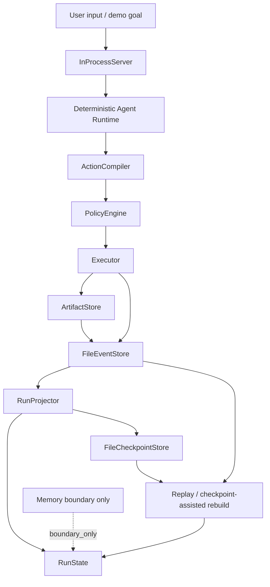

# Demo Architecture v0.1

状态：`current`

## 1. Purpose

这份图只解释 v0.1 demo 的 runtime path，不是完整 Isotope 架构图。

它的目标是帮助外部读者快速理解 `python -m isotope.demo` 跑通了什么：一个本地 deterministic kernel loop（确定性内核闭环），从 input 到 action chain，再到 artifact、canonical events、projector、checkpoint 和 replay verification。

这张图不声明 real LLM、HTTP server、external ingestion、real memory storage/query 或 plugin system 已实现。

## 2. Demo Flow

## 3. What Is Canonical

- canonical events drive `RunState`.
- artifacts are referenced by structured refs, not inlined as full content.
- checkpoints are derived read acceleration, not a second source of truth.
- memory appears only through boundary / read-model events in the current slice.

## 4. What Is Not In This Diagram

- real LLM.
- HTTP server.
- external ingestion.
- real memory storage / query.
- UI.
- hosted deployment.

## 5. How To Read The Diagram

左边是输入和动作链：demo goal 进入 `InProcessServer`，deterministic agent runtime 生成一个 artifact-producing intent，然后由 `ActionCompiler` 编译成 canonical action proposal。

中间是 policy-gated execution：`PolicyEngine` 生成 `PolicyDecision`，`Executor` 只能使用 policy grants 执行。当前 successful side-effect handler 仍是 deterministic `write_artifact_tool`，不是 plugin system。

右边是 event log、projector、state 和 checkpoint：artifact 和 executor lifecycle 都落到 canonical events，`RunProjector` 只从 events 投影 `RunState`。checkpoint 只是 projector-owned read acceleration，demo 会验证 fresh replay 和 checkpoint-assisted rebuild 都能恢复等价 read model。

memory 目前只是边界展示：`memory_status` 是 `boundary_only`，说明 v0.1 demo 展示的是 structured memory contract、canonical memory events、replay 和 checkpoint boundary，不是真实 durable memory storage/query engine。
